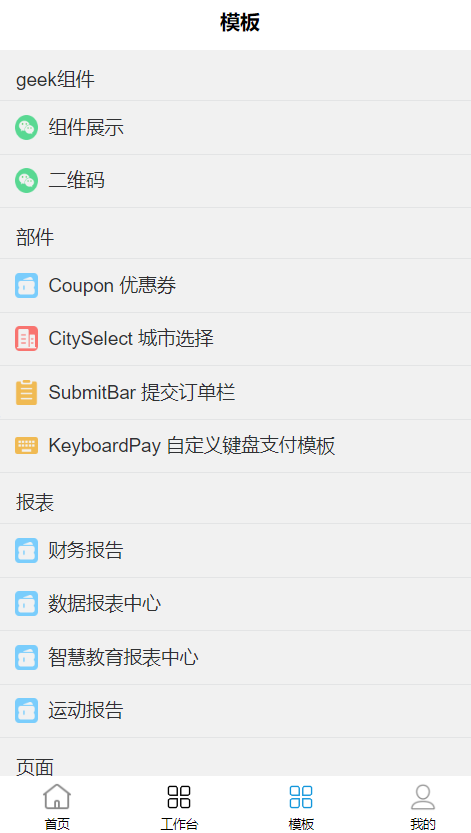
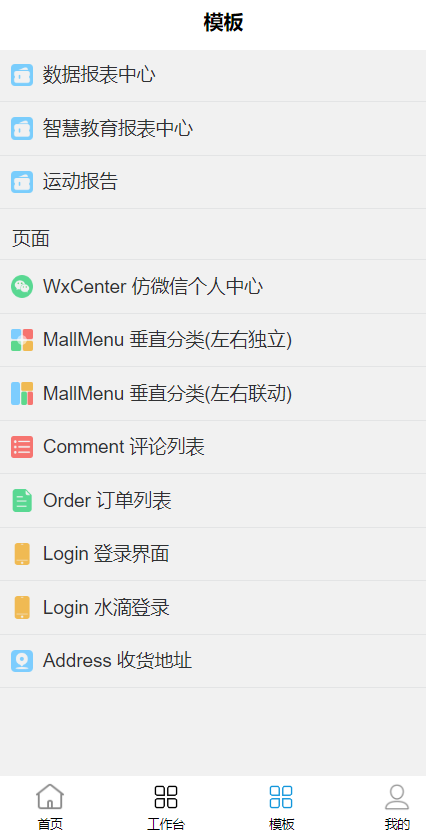
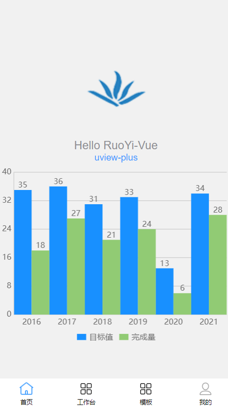
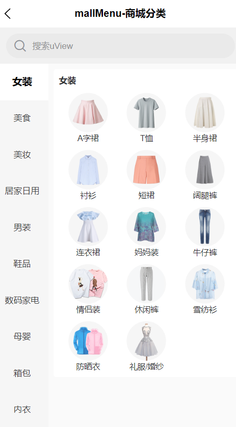

## 简介

若依极客生态App版本是 RuoYi-App 框架的基础上进行了二次开发，采用了 Uniapp 结合 Vue3 的技术栈。它同时支持 JavaScript 和 TypeScript 开发，并且兼容 CSS、SCSS 以及 Less 样式语言。为了优化性能，我们已经对代码进行了初步的分包处理。此外，我们集成了 uview-plus、uchart和相关的模板供大家参考和使用。

# 功能演示

<table>
    <tr>
        <td></td>
        <td></td>
    </tr>
    <tr>
        <td></td>
        <td></td>
    </tr>
</table>
