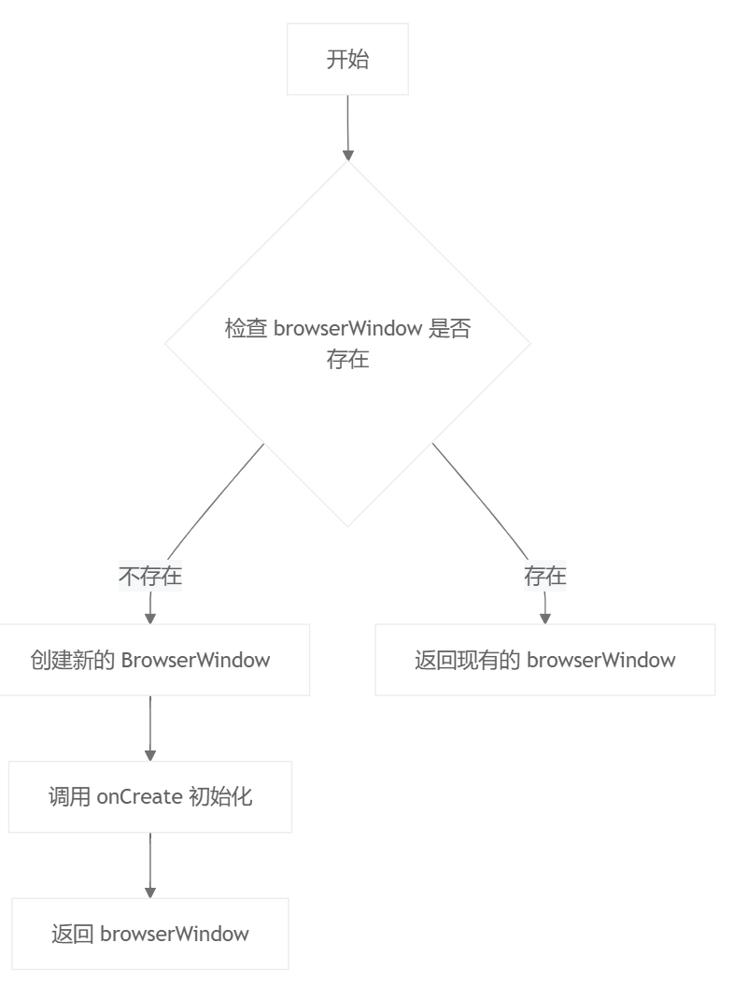

# Electron学习笔记

--基于框架学习

# 主进程index.js

### getwindow()

```bash
  static getWindow() {
    if (!this.browserWindow) {
      this.browserWindow = new electron.BrowserWindow(this.browserWindowOptions);
      this.onCreate(this.browserWindow);
      return this.browserWindow;
    } else {
      return this.browserWindow;
    }
  }
}
```

定义了一个静态方法 getWindow，用于获取或创建一个 Electron 的浏览器窗口。具体功能如下：

1. 检查 this.browserWindow 是否存在。
2. 如果不存在，则创建一个新的 BrowserWindow 实例，并调用 onCreate 方法进行初始化，最后返回该实例。
3. 如果已存在，则直接返回现有的 browserWindow。



### 配置应用主窗口

```bash
class IndexWindow extends BaseWindow {
  static browserWindowOptions = {
    width: 900,
    height: 670,
    show: false,
    autoHideMenuBar: true,
    ...process.platform === "linux" ? { icon } : {},
    webPreferences: {
      preload: path.join(__dirname, "../preload/index.js"),
      sandbox: false,
      nodeIntegration: true,
      // 开启自带node环境
      webviewTag: true,
      // 开启webview
      contextIsolation: true,
      // 开启context上下文
      webSecurity: false,
      // 开启网络安全
      allowRunningInsecureContent: true
      // 允许运行不安全内容
    }
  };
```

配置 Electron 应用的主窗口，包括窗口大小、初始状态、菜单栏设置以及 WebPreferences 的详细配置，确保应用在启动时能够按照预期的行为进行渲染和交互。

### onCreate

```bash
static onCreate(context) {
    context.on("ready-to-show", () => {
      context.show();
    });
    context.webContents.setWindowOpenHandler((details) => {
      electron.shell.openExternal(details.url);
      return { action: "deny" };
    });
    if (utils.is.dev && process.env["ELECTRON_RENDERER_URL"]) {
      context.webContents.openDevTools();
      context.loadURL(process.env["ELECTRON_RENDERER_URL"]);
    } else {
      context.loadFile(path.join(__dirname, "../renderer/index.html"));
    }
  }
}

```

创建和初始化一个Electron应用窗口的静态方法onCreate。主要功能如下：

1. 监听窗口准备就绪事件（44-46）：当窗口准备好显示时，调用context.show()显示窗口。
2. 处理新窗口打开请求（47-50）：拦截新窗口打开请求，使用默认浏览器打开链接，并拒绝创建新窗口。
3. 加载开发或生产环境资源（51-56）：
   o	如果是开发环境且设置了环境变量ELECTRON_RENDERER_URL，则打开开发者工具并加载指定URL。
   o	否则，加载本地HTML文件。

# 应用主进程

```ts
electron.app.whenReady().then(() => {
  utils.electronApp.setAppUserModelId("com.electron");
  electron.app.on("browser-window-created", (_, window) => {
    utils.optimizer.watchWindowShortcuts(window);
  });
  electron.ipcMain.on("ping", () => console.log("pong"));
  createWindow();
  electron.app.on("activate", function() {
    if (electron.BrowserWindow.getAllWindows().length === 0) createWindow();
  });
});
electron.app.on("window-all-closed", () => {
  if (process.platform !== "darwin") {
    electron.app.quit();
  }
});
Electron应用的主进程（main process）部分，主要负责在应用启动时执行一系列初始化操作，并处理窗口管理和应用关闭事件。具体功能如下：
1.	应用准备就绪时：
o	设置应用程序模型ID为com.electron。
o	监听browser-window-created事件，在创建浏览器窗口时调用utils.optimizer.watchWindowShortcuts(window)方法来监控窗口快捷键。
o	监听ping IPC消息，并在收到消息时打印pong。
o	调用createWindow()函数创建主窗口。
o	监听activate事件，当应用被激活且没有打开的窗口时，重新创建主窗口。
2.	所有窗口关闭时：
o	如果操作系统不是macOS（darwin），则退出应用。（苹果系统特点）

```

# 预处理进程：

```ts
"use strict";
const electron = require("electron");
const preload = require("@electron-toolkit/preload");
const api = {};
if (process.contextIsolated) {
  try {
    electron.contextBridge.exposeInMainWorld("electron", preload.electronAPI);
    electron.contextBridge.exposeInMainWorld("api", api);
  } catch (error) {
    console.error(error);
  }
} else {
  window.electron = preload.electronAPI;
  window.api = api;
}
```

用于在渲染进程（renderer process）中安全地暴露API给网页内容。具体功能如下：

1. 严格模式：
   o	使用"use strict"确保代码运行在严格模式下，避免一些常见的编程错误。
2. 引入依赖：
   o	引入electron模块和@electron-toolkit/preload模块。
   o	定义一个空对象api，用于自定义API。
3. 上下文隔离检查：
   o	检查process.contextIsolated是否为true，以确定是否启用了上下文隔离（context isolation）。
4. 上下文隔离启用时：
   o	使用electron.contextBridge.exposeInMainWorld方法将preload.electronAPI和自定义的api暴露给主世界（main world），即网页内容可以访问这些API。
   o	如果暴露过程中发生错误，捕获并打印错误信息。
5. 上下文隔离未启用时：
   o	直接将preload.electronAPI和api挂载到全局window对象上，使网页内容可以直接访问这些API。

#API解释与作用：
•	API 是一种接口，允许不同软件组件之间进行通信。
•	在Electron应用中，API通过预加载脚本安全地暴露给渲染进程，以便前端代码可以调用这些API与主进程或其他部分进行交互。
•	api对象可以包含自定义的方法和属性，根据需求进行扩展。

# 渲染进程

```ts
<html>
  <head>
    <meta charset="UTF-8" />
    <title>Electron</title>
    <!-- https://developer.mozilla.org/en-US/docs/Web/HTTP/CSP -->
    <meta
      http-equiv="Content-Security-Policy"
      content="default-src 'self'; script-src 'self'; style-src 'self' 'unsafe-inline'; img-src 'self' data:"
    />
    <script type="module" crossorigin src="./assets/index-CAbg6zdV.js"></script>
    <link rel="stylesheet" crossorigin href="./assets/index-CsbMxbyG.css">
  </head>

  <body>
    <div id="app"></div>
  </body>
</html>
```

配置了内容安全策略，引入了必要的JavaScript模块和CSS样式文件。页面主体中有一个 `<div id="app"></div>`元素，用于作为前端框架的挂载点或放置主要内容。
