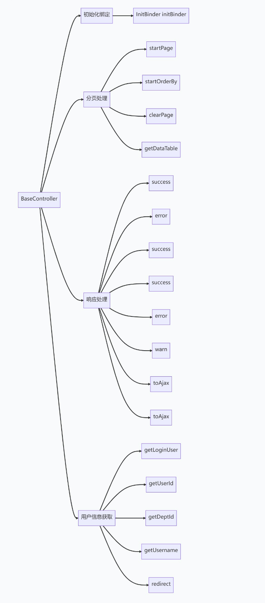

# RuoYi-Geek-SpringBoot3核心逻辑理解

```
core
├── controller
│   └── BaseController.java  # 控制器基类，处理HTTP请求
├── domain
│   ├── entity
│   │   ├── FileEntity.java  # 文件实体类
│   │   ├── SysDept.java     # 系统部门实体类
│   │   ├── SysDictData.java # 系统字典数据实体类
│   │   ├── SysDictType.java # 系统字典类型实体类
│   │   ├── SysMenu.java     # 系统菜单实体类
│   │   ├── SysRole.java     # 系统角色实体类
│   │   └── SysUser.java     # 系统用户实体类
│   └── model
│   │   ├── LoginBody.java   # 登录请求体模型类
│   │   ├── LoginUser.java   # 登录用户模型类
│   │   ├── RegisterBody.java# 注册请求体模型类
│   ├── AjaxResult.java  # 异步请求结果模型类
│   ├── BaseEntity.java  # 基础实体类
│   ├── Message.java     # 消息模型类
│   ├── R.java           # 响应模型类
│   ├── TreeEntity.java  # 树形实体类
│   └── TreeSelect.java  # 树形选择模型类
├── page
│   ├── PageDomain.java      # 分页领域模型类
│   ├── TableDataInfo.java   # 表格数据信息模型类
│   └── TableSupport.java    # 表格支持类
├── security\service
│   └── IPermissionService.java # 权限服务接口
└── text
    ├── CharsetKit.java      # 字符集工具类
    ├── Convert.java         # 转换工具类
    └── StrFormatter.java    # 字符串格式化工具类
```




## 分页处理

1、startPage：开始分页。

2、startOrderBy：设置排序规则。

3、clearPage：清理分页线程变量。

4、getDataTable：返回分页数据，包含总记录数和当前页的数据列表。

## 响应处理

1、success：返回成功消息（无参数）。

2、error：返回失败消息（无参数）。

3、success(String message)：返回带有自定义消息的成功响应。

4、success(Object data)：返回带有数据的成功响应。

5、error(String message)：返回带有自定义消息的失败响应。

6、warn(String message)：返回带有警告消息的响应。

7、toAjax(int rows)：根据影响行数返回成功或失败响应。

8、toAjax(boolean result)：根据布尔结果返回成功或失败响应。

## 用户信息获取

1、getLoginUser：获取当前登录用户的缓存信息。

2、getUserId：获取当前登录用户的 ID。

3、getDeptId：获取当前登录用户的部门 ID。

4、getUsername：获取当前登录用户的用户名。

5、redirect(String url)：页面跳转。
