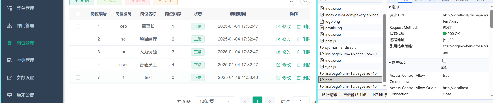

# 数据读取


### 前端发起请求:
```
  前端向后端发送GET请求

  请求URL为http://localhost/dev-api/sys/post/list?pageNum=1&pageSize=10。
```

### 后端处理请求:
```
  后端接收到请求后，查询数据库获取岗位管理数据。

  将查询结果封装成JSON格式返回给前端。
```

### 前端接收响应:
```
  前端接收到后端返回的JSON数据。

  解析JSON数据并将其渲染到页面上，显示在表格中。
```


# 数据更改（增删改查）



### 前端发起请求:
```
  前端向后端发送POST请求

  请求URL为http://localhost/dev-api/sys/post。
```

### 后端处理请求:
```
  后端接收到请求后，处理新增岗位数据

  将新增结果返回给前端
```

### 前端接收响应:
```
  前端接收到后端返回的响应

  根据响应结果更新前端界面
```
