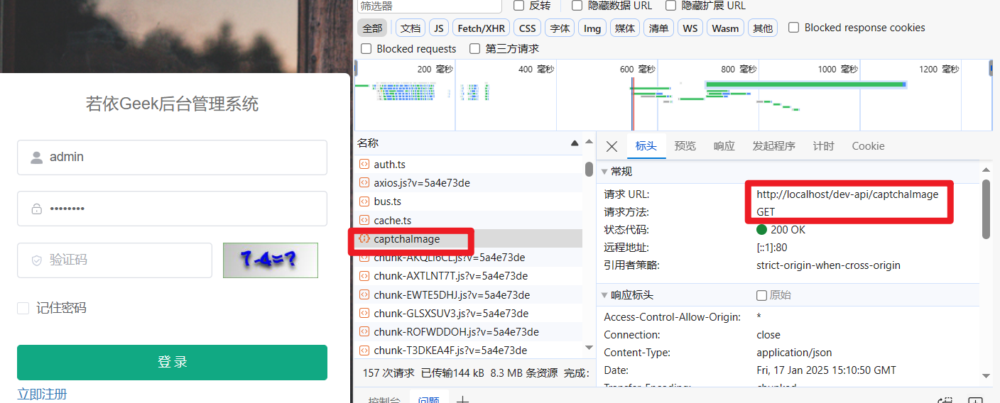
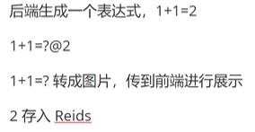

# 交互

## 验证码

系统发出GET请求，请求方法为captchaImage，向前端发出请求，通过反向代理，url请求前端，进行代理，映射到后端，解决跨域问题



```
请求url：http://localhost/dev-api/captchaImage
```

后端：创建ajax对象，判断是否开启验证码验证，若开启，生成键值，判断生成数字还是字符串类验证码，数字类验证码生成表达式，以@作为分割，做不同处理

```
// 映射HTTP GET请求到 /captchaImage 路径上，由 getCode 方法处理。
    @GetMapping("/captchaImage")
    public AjaxResult getCode(HttpServletResponse response) throws IOException {
    ······
    }
```




## 登录


# java/com/ruoyi

## web

### controller

#### common

##### CaptchaController.java:验证码操作处理

该控制器处理HTTP GET请求以生成并返回验证码图像，并将验证码信息存储在缓存中以便后续验证使用

```
  //通过 @Resource 注解注入了两个不同类型的验证码生产者实例captchaProducer和captchaProducerMath，分别用于生成字符型和数学运算型验证码。
    @Resource(name = "captchaProducer")
    private Producer captchaProducer;

    @Resource(name = "captchaProducerMath")
    private Producer captchaProducerMath;
```

##### CommonController.java:文件上传下载

该控制器提供了处理通用文件下载和上传请求的功能，包括单文件和多文件上传，以及两种方式的文件下载。通过使用 `@RestController`, `@GetMapping`, 和 `@PostMapping` 注解，使得每个方法可以轻松地映射到HTTP请求上。

```
 //映射HTTP GET请求到/download路径上，由filedownload方法处理
    //处理GET请求 /common/download
    @GetMapping("/download")
    @Anonymous
    public void fileDownload(
            @RequestParam("fileName") String fileName,
            @RequestParam("delete") Boolean delete,
            HttpServletResponse response,
            HttpServletRequest request) {
  
            }

//处理POST请求 /common/upload 以上传单个文件
    @PostMapping("/upload")
    @Anonymous
    public AjaxResult uploadFile(@RequestBody MultipartFile file) throws Exception {

            }
```

#### monitor

##### CacheController.java：缓存管理

该控制器提供了对缓存的监控和管理功能，包括获取缓存名称列表、获取特定缓存中的键列表、获取特定缓存键对应的值、清除特定缓存或所有缓存等操作。

```
//获取缓存值列表,只有monitor:cache:list权限的用户才能访问,设置了路径参数 cacheName 和 cacheKey
    @PreAuthorize("@ss.hasPermi('monitor:cache:list')")
    @GetMapping("/getValue/{cacheName}/{cacheKey}")
  
    public AjaxResult getCacheValue(@PathVariable String cacheName, @PathVariable String cacheKey)
    {
        ValueWrapper valueWrapper = CacheUtils.get(cacheName, cacheKey);
        //创建一个 SysCache 对象，存储缓存名称、缓存键名和缓存值。
        SysCache sysCache = new SysCache();
  
    }
```

##### ServerController.java

该控制器主要用于获取服务器的监控信息，通过调用 `/monitor/server` 这个GET接口，经过权限验证后，可以得到服务器状态的相关信息，并通过RESTful API提供给客户端。

##### SysLogininfoController.java

该控制器主要用于管理系统的访问记录（登录信息），包括获取、导出、删除和清理这些记录，以及解锁用户账户。

##### SysUserOnlineController.java

该控制器主要用于管理操作日志记录，包括获取、导出、删除和清理这些记录。

#### system

SysConfigController.java

它主要用于管理系统配置参数，允许用户通过HTTP请求执行查询、添加、修改、删除以及导出等操作。

SysDeptController.java

该控制器主要用于管理系统的部门信息，包括获取、查询、新增、修改和删除部门等操作。

SysDictDataController.java

该控制器主要用于管理系统中的数据字典信息，包括查询、导出、新增、修改和删除字典数据等操作。

SysDictTypeController.java

该控制器主要用于管理系统中的数据字典类型信息，包括查询、导出、新增、修改、删除以及刷新缓存等操作

SysIndexController.java

该控制器主要用于处理访问系统首页的请求，并返回一个提示信息给用户。

SysLoginController.java

该控制器主要用于处理用户登录验证、获取用户信息以及获取路由信息等操作。

#### tool

### core

## RuoYiApplication.java：启动程序

启动程序，输出启动成功标识，获取环境配置对象env（用于读取配置文件），读取IP、端口信息并输出

## RuoYiServletInitializer.java:部署应用运行

继承公共类，重写configure方法，将springboot应用在servlet容器中进行部署

# resources

# pom.xml
