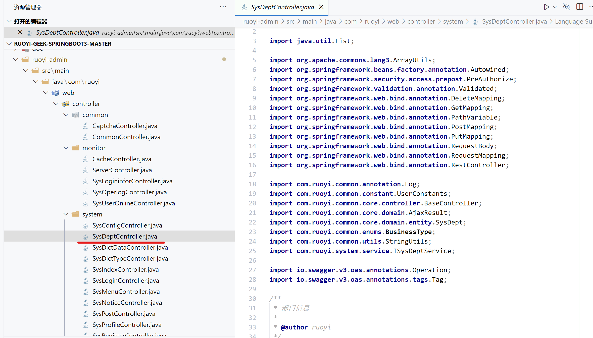
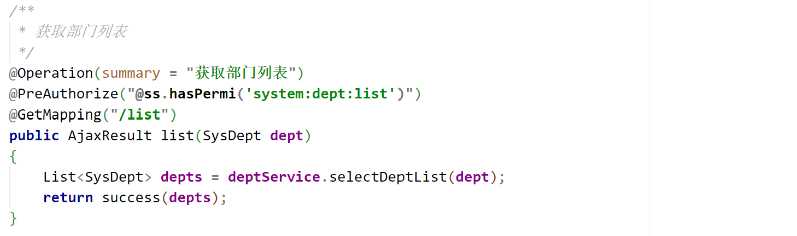
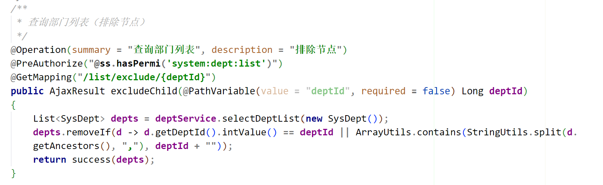
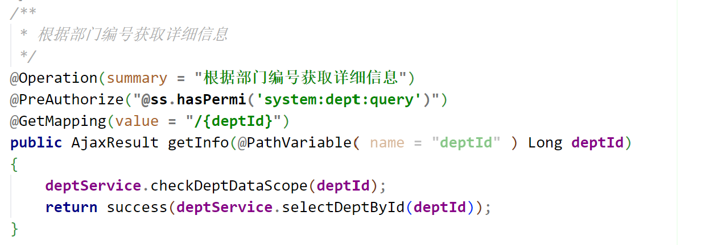
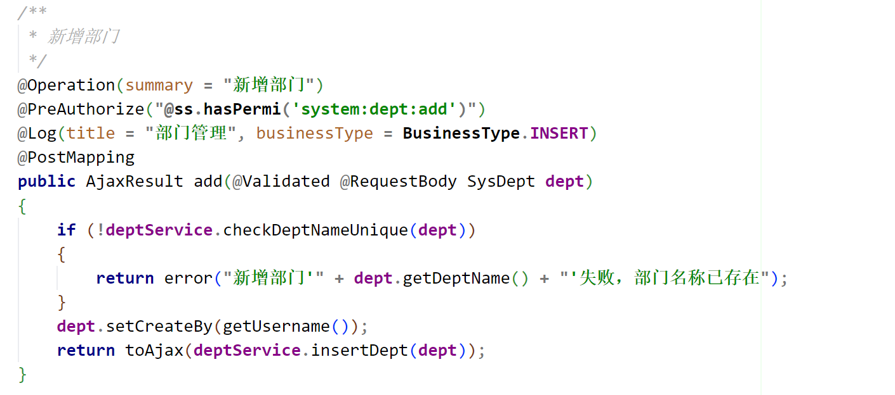
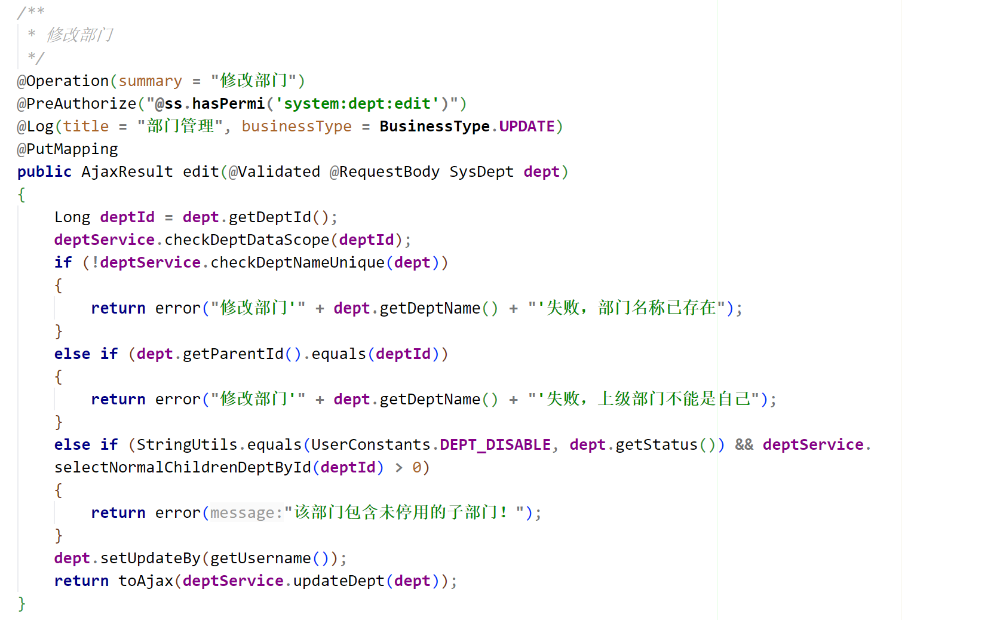
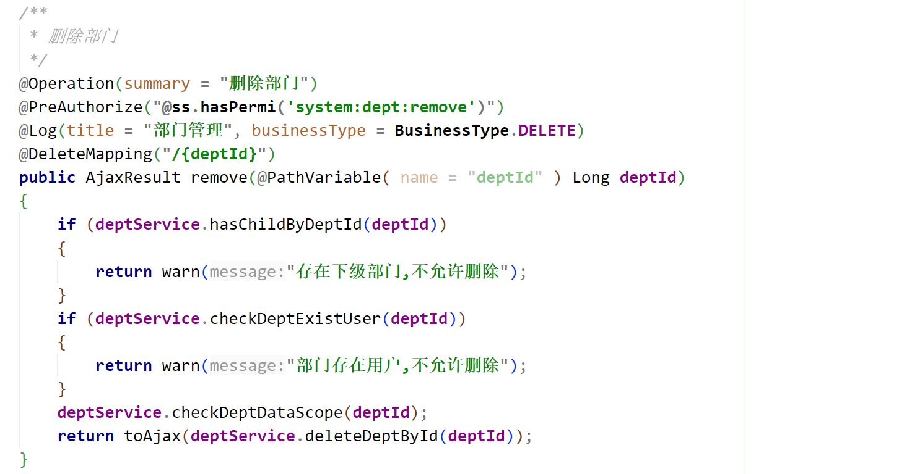

# 控制类SysDeptController(用于处理与部门信息相关的前端数据处理请求)



## GET请求处理

### 获取部门列表


```
List<SysDept> depts = deptService.selectDeptList(dept);//调用服务层的方法，获取部门列表。
```

### 查询部门列表（排除节点）


```
List<SysDept> depts = deptService.selectDeptList(new SysDept()); //调用服务层的方法，获取所有部门列表。

depts.removeIf(...) //从部门列表中移除指定的部门及其子部门。

```

### 根据部门编号获取详细信息


```
deptService.checkDeptDataScope(deptId) // 检查当前用户是否有权限访问该部门的数据。

return success(deptService.selectDeptById(deptId)) // 返回一个包含指定部门详细信息的AjaxResult对象。
```

 ## POST请求处理

  ### 新增部门


```
deptService.checkDeptNameUnique(dept) //检查部门名称是否唯一。

dept.setCreateBy(getUsername()) //设置部门名称。

return toAjax(deptService.insertDept(dept)) //返回一个包含新增结果的AjaxResult对象。
```

 ## PUT请求处理

  ### 修改部门


```
deptService.checkDeptDataScope(deptId) //检查当前用户是否有权限访问该部门的数据。

deptService.checkDeptNameUnique(dept) // 检查部门名称是否唯一。

dept.getParentId().equals(deptId) //检查上级部门是否是自己。

StringUtils.equals(UserConstants.DEPT_DISABLE, dept.getStatus()) // 检查部门状态是否为禁用。

deptService.selectNormalChildrenDeptById(deptId) > 0 // 检查该部门是否有未停用的子部门。

dept.setUpdateBy(getUsername()) // 设置部门名称。

return toAjax(deptService.updateDept(dept)) //返回一个包含修改结果的AjaxResult对象。
```

## DELETE请求处理

### 删除部门


```
deptService.hasChildByDeptId(deptId) // 检查该部门是否有子部门。

deptService.checkDeptExistUser(deptId) // 检查该部门是否有用户。

deptService.checkDeptDataScope(deptId) // 检查当前用户是否有权限访问该部门的数据。

return toAjax(deptService.deleteDeptById(deptId)) // 返回一个包含删除结果的AjaxResult对象。
```