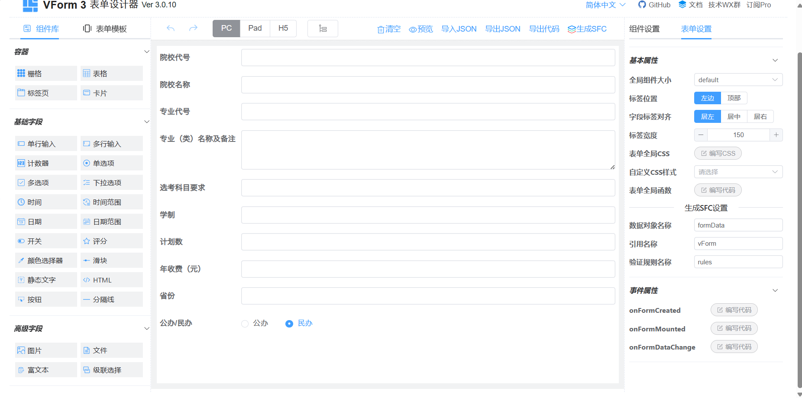
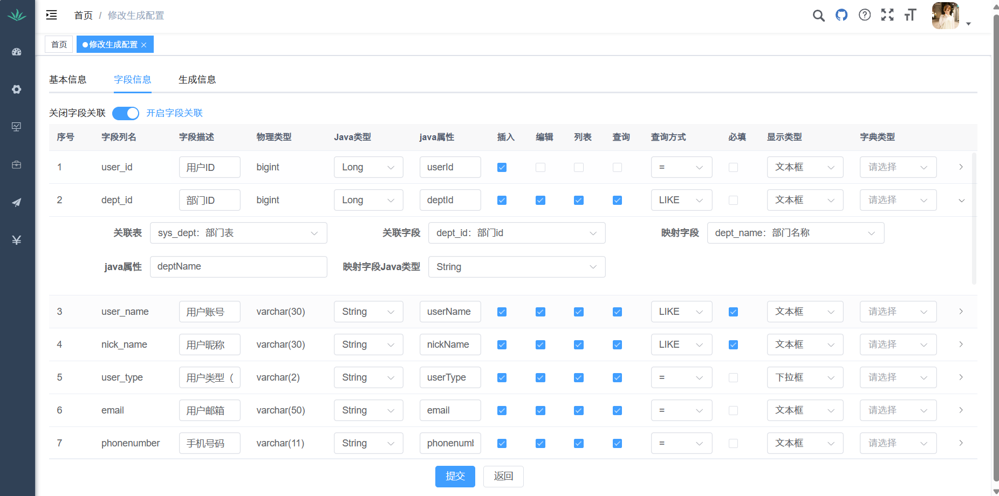
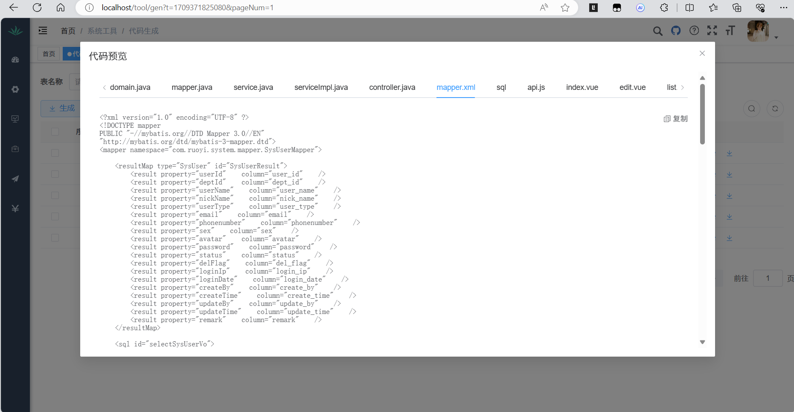

# 当前版本是3.8.7.3

本人的其他两个推荐搭配的项目

1. [RuoYi-App-Geek: 这是若依极客生态的小程序版本 (gitee.com)](https://gitee.com/geek-xd/geek-uniapp-vue3-uview-plus-uchart)
2. [RuoYi-SpringBoot3-Geek: 这是若依极客生态的SpringBoot3版本 (gitee.com)](https://gitee.com/geek-xd/ruoyi-spring-boot3-geek.git)

与本项目同为一个作者开发，兼容性最好，学习成本最低

## 前端运行

```bash
# 克隆项目
git clone https://gitee.com/geek-xd/ruoyi-geek-vue3.git

# 进入项目目录
cd RuoYi-Vue3

# 安装依赖
yarn --registry=https://registry.npmmirror.com

# 启动服务
yarn dev

# 构建测试环境 yarn build:stage
# 构建生产环境 yarn build:prod
# 前端访问地址 http://localhost:80
```

## 内置功能

1. 用户管理：用户是系统操作者，该功能主要完成系统用户配置。
2. 部门管理：配置系统组织机构（公司、部门、小组），树结构展现支持数据权限。
3. 岗位管理：配置系统用户所属担任职务。
4. 菜单管理：配置系统菜单，操作权限，按钮权限标识等。
5. 角色管理：角色菜单权限分配、设置角色按机构进行数据范围权限划分。
6. 字典管理：对系统中经常使用的一些较为固定的数据进行维护。
7. 参数管理：对系统动态配置常用参数。
8. 通知公告：系统通知公告信息发布维护。
9. 操作日志：系统正常操作日志记录和查询；系统异常信息日志记录和查询。
10. 登录日志：系统登录日志记录查询包含登录异常。
11. 在线用户：当前系统中活跃用户状态监控。
12. 定时任务：在线（添加、修改、删除)任务调度包含执行结果日志。
13. 代码生成：前后端代码的生成（java、html、xml、sql）支持CRUD下载 。
14. 系统接口：根据业务代码自动生成相关的api接口文档。
15. 服务监控：监视当前系统CPU、内存、磁盘、堆栈等相关信息。
16. 缓存监控：对系统的缓存信息查询，命令统计等。
17. 在线构建器：拖动表单元素生成相应的HTML代码。
18. 连接池监视：监视当前系统数据库连接池状态，可进行分析SQL找出系统性能瓶颈。

### 新加功能和增强功能演示

<table>
    <tr>
        <td></td>
        <td></td>
    </tr>
    <tr>
        <td></td>
        <td></td>
    </tr>
    <tr>
        <td></td>
        <td></td>
    </tr>
</table>

# 联系我们：

### 技术交流群 QQ：744785891

欢迎所有对 RuoYi-Geek 感兴趣的开发者加入我们的社区😆！


### 商业合作😆

我们欢迎各类商业合作机会，无论是技术咨询、项目合作还是其他形式的合作，都期待与您携手共创未来。
如果您有兴趣，请通过以下方式联系我们：

<table>
  <tr>
    <td>
      <strong>QQ</strong><br/>
      QQ号：2086232477  
    </td>
    <td>
      <strong>微信</strong><br/>
      微信号：tantianming000  
    </td>
  </tr>
    <tr>
        <td>
            
        </td>
        <td>
              
        </td>
    </tr>
</table>

我们期待着与您建立长期稳定的合作关系，并共同探索更多的可能性。
